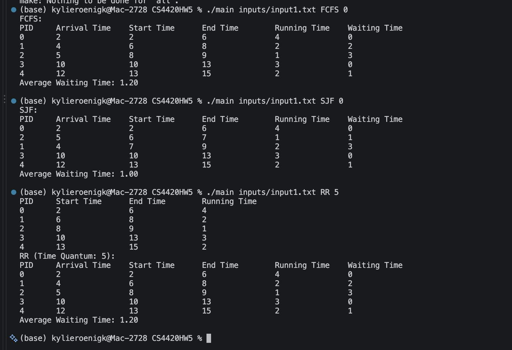
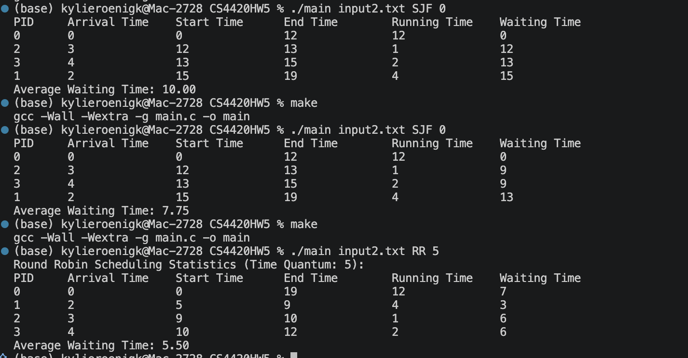
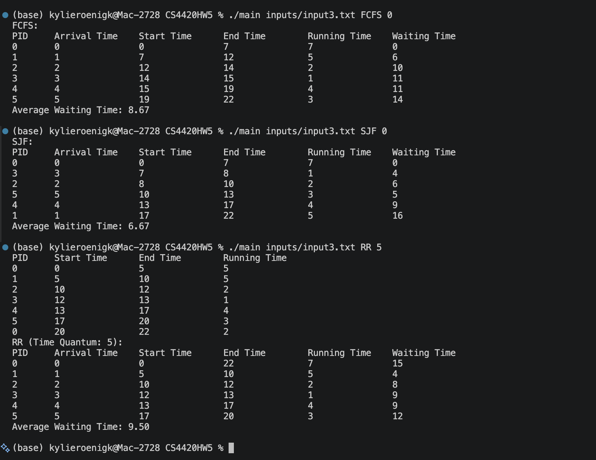

# Assignment 5 - Implementing a CPU Scheduler

## How to run this Program

This program has a Makefile to compile the executable and run all input test files.

- To compile the program, run:

  ```sh
  make
  ```

- To run every test input with FCFS, Round Robin, and SJF, run:

  ```sh
  make test
  ```

- To run one input file manually, use:

  ```sh
  ./main input.txt FCFS 0
  ./main input.txt RR 2
  ./main input.txt SJF 0
  ```

The third argument is only used by Round Robin; it is still required by the
program for the other scheduling algorithms.

## Test Cases

The test inputs are `input1.txt`, `input2.txt`, and `input3.txt`.

### Testing Screenshots




